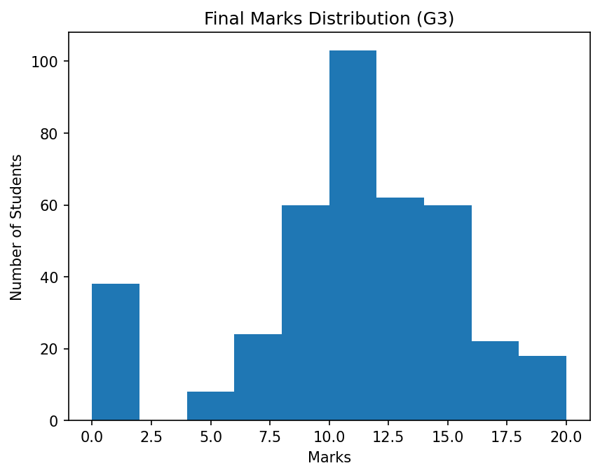
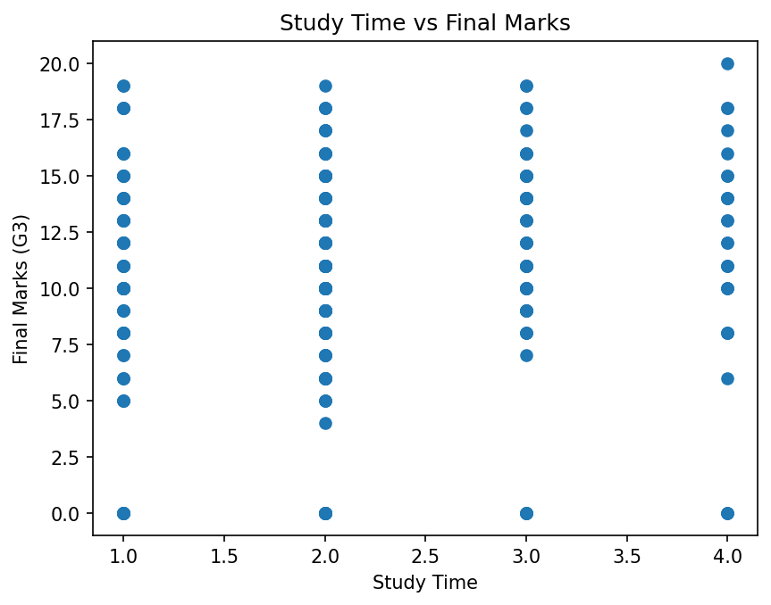
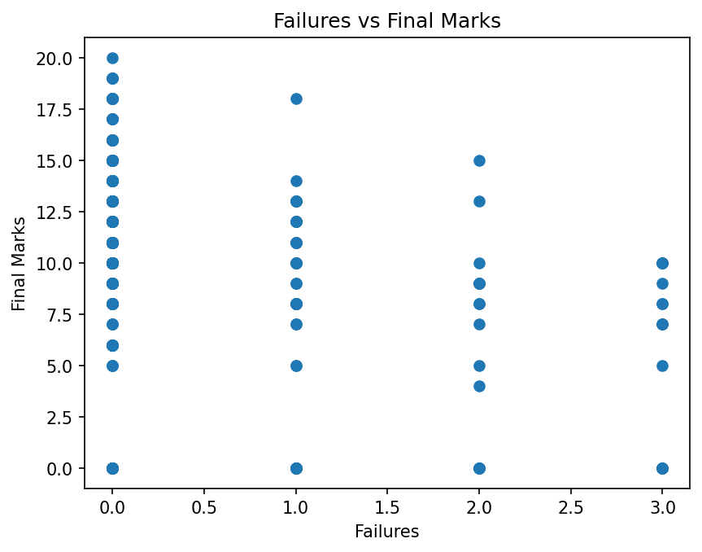
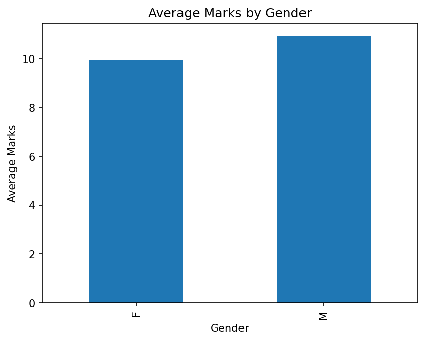
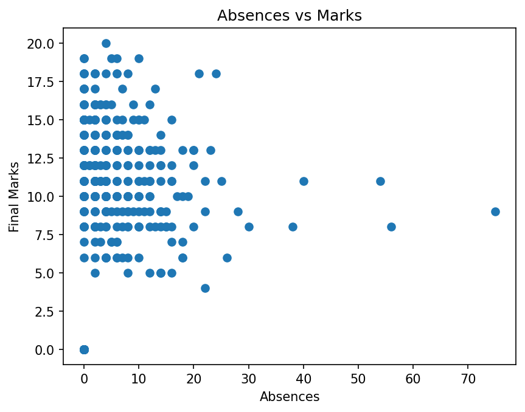
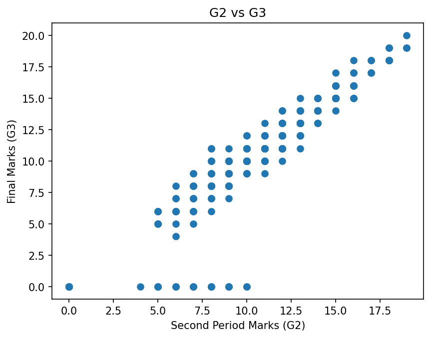
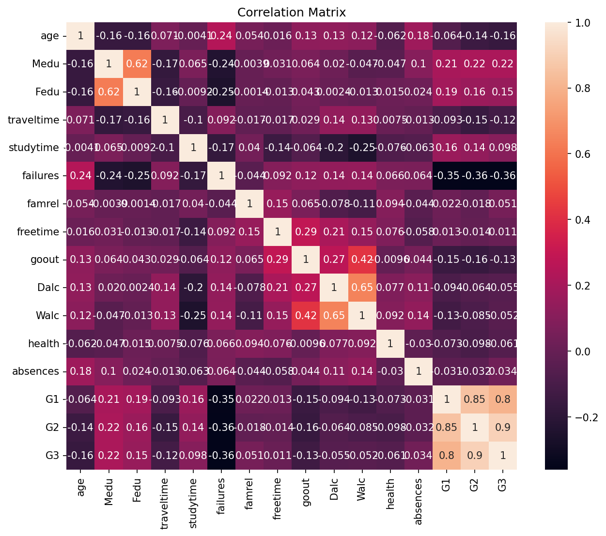
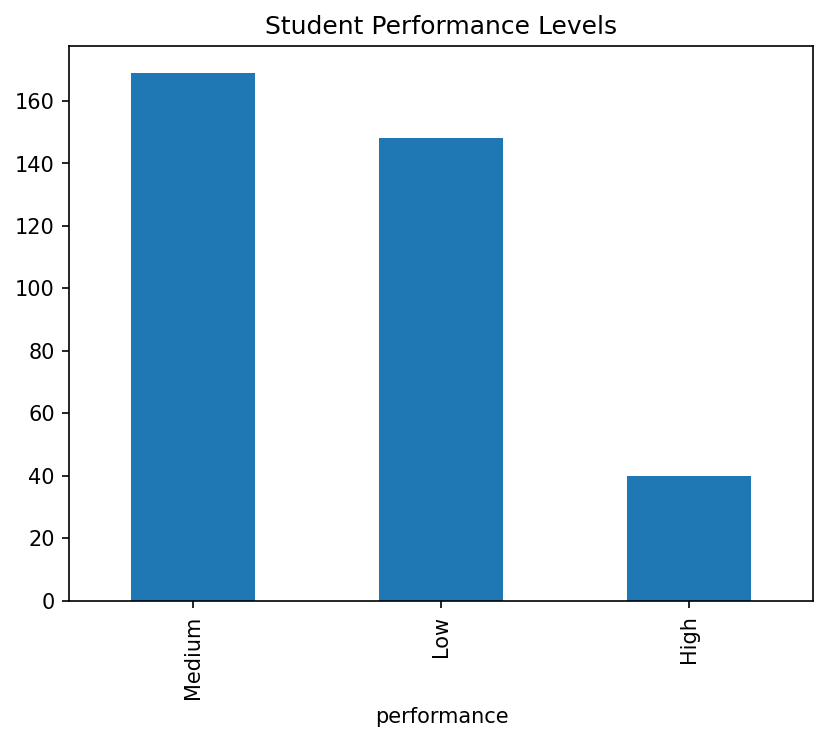

# 📊 Student Performance Analysis

Analysis of student academic data to identify which factors — study time, 
past grades, absences, and failures — most strongly influence final exam 
marks (G3). Includes a regression model to predict final marks from these 
features.

## Tools Used
Python · pandas · numpy · matplotlib · seaborn · scikit-learn

## Data Source
UCI Machine Learning Repository — Student Performance Dataset

## Project Structure
student-performance-analysis/
├── outputs/ # saved chart images
├── student_analysis.ipynb
├── student_data.csv
├── requirements.txt
└── README.md


## Key Findings

- Second-period marks (G2) show the strongest relationship with final marks 
  (G3) — recent academic performance is the best predictor of final outcomes.
- Higher failure counts are associated with noticeably lower final marks; 
  the average student in the dataset has failed 0.33 classes.
- Students average 5.71 absences and a study-time score of 2.04 (on a 1-4 
  scale), with an average final mark of 10.42 out of 20.
- Students split into performance bands as: 148 Low, 169 Medium, 40 High.
- A Random Forest model (R² = 0.873, MAE = 1.05) meaningfully outperformed 
  a Linear Regression baseline (R² = 0.782, MAE = 1.34), showing final 
  marks depend on non-linear interactions between features.

## Visualizations

### Distribution of Final Marks (G3)


### Study Time vs Final Marks


### Past Failures vs Final Marks


### Average Marks by Gender


### Absences vs Final Marks


### Second-Period Marks (G2) vs Final Marks (G3)


### Correlation Matrix of All Numeric Features


### Performance Level Distribution


## How to Run
```bash
git clone https://github.com/arju109/student-performance-analysis.git
cd student-performance-analysis
pip install -r requirements.txt
jupyter notebook student_analysis.ipynb
```

## Author
**Arju** — [GitHub](https://github.com/arju109)
